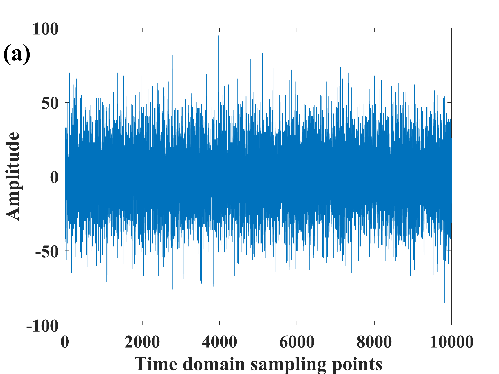
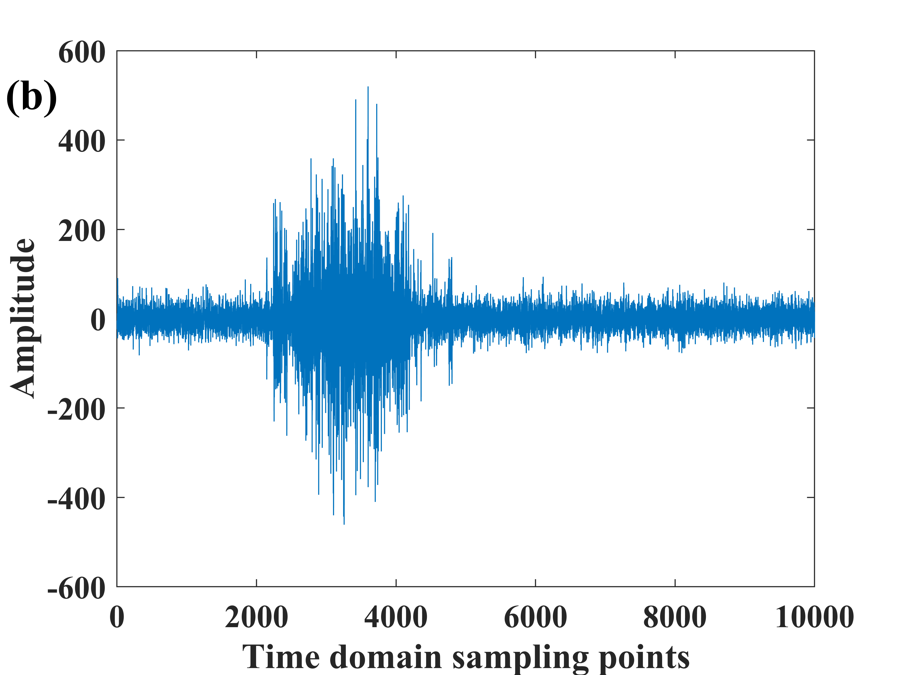
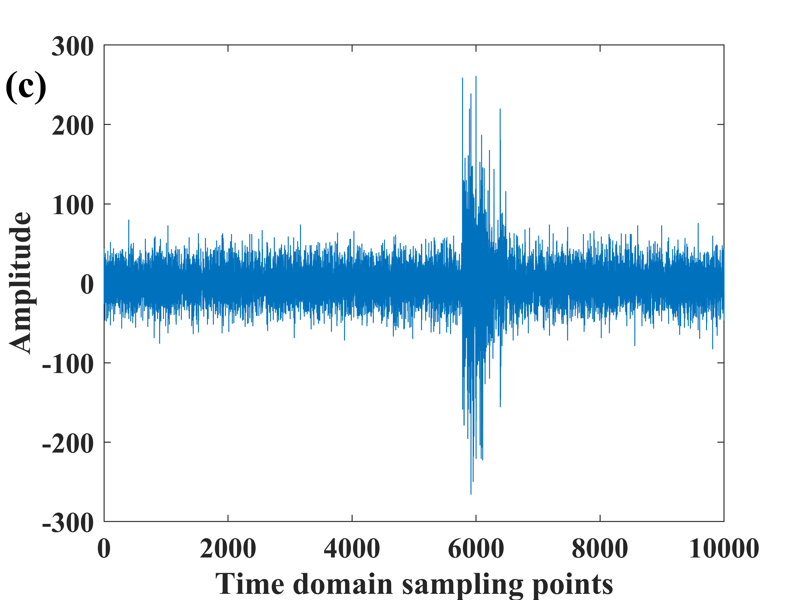
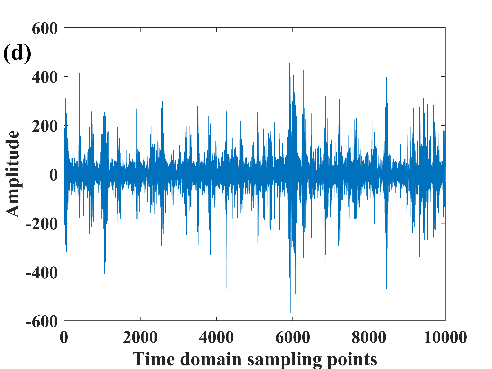
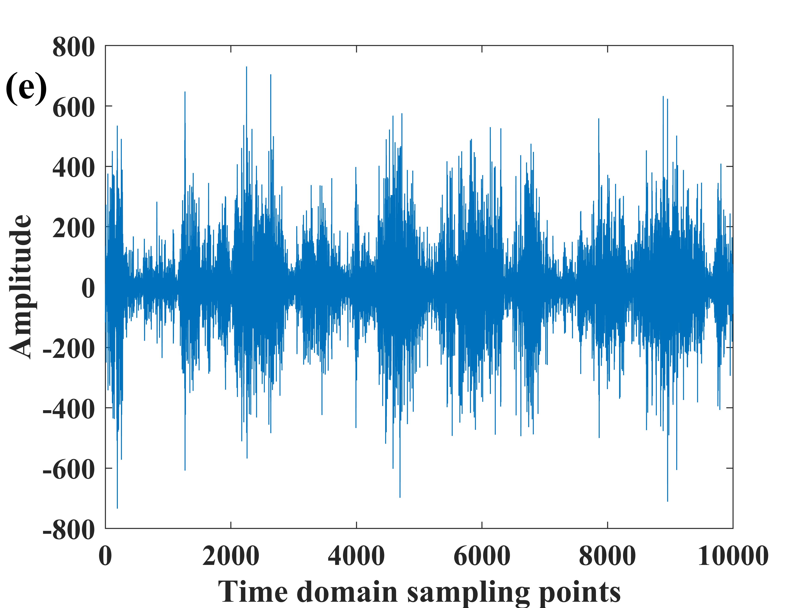
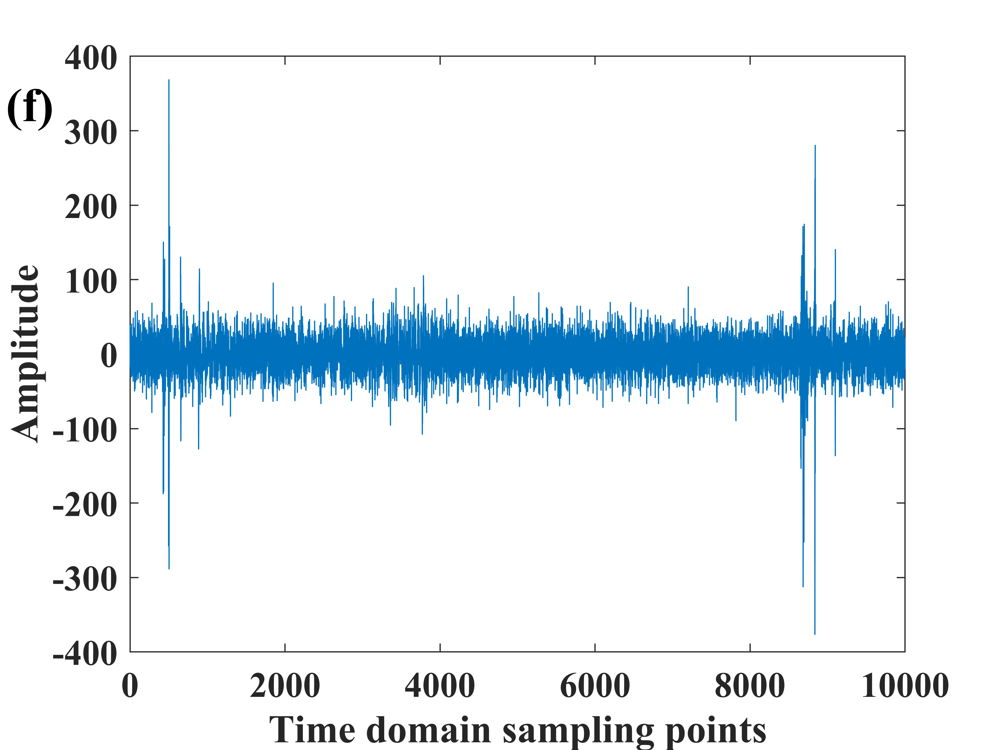

数据来源：https://github.com/BJTUSensor/Phi-OTDR_dataset_and_codes

分布式光纤传感 DOFS DAS 扰动信号识别常用特征，
在BJTU基础上进行了一些修正，特征计算公式在发表论文中，feature.py为特征计算代码。

孙敏, 方捻. 光纤扰动信号识别的可解释性特征选择方法[J]. 光学学报, 2024, 44(21): 2106007.

Min Sun, Nian Fang. Interpretable Feature Selection Method for Optical-Fiber Disturbance Signal Recognition[J]. Acta Optica Sinica, 2024, 44(21): 2106007.

不同信号类型时域差分后波形如下：

